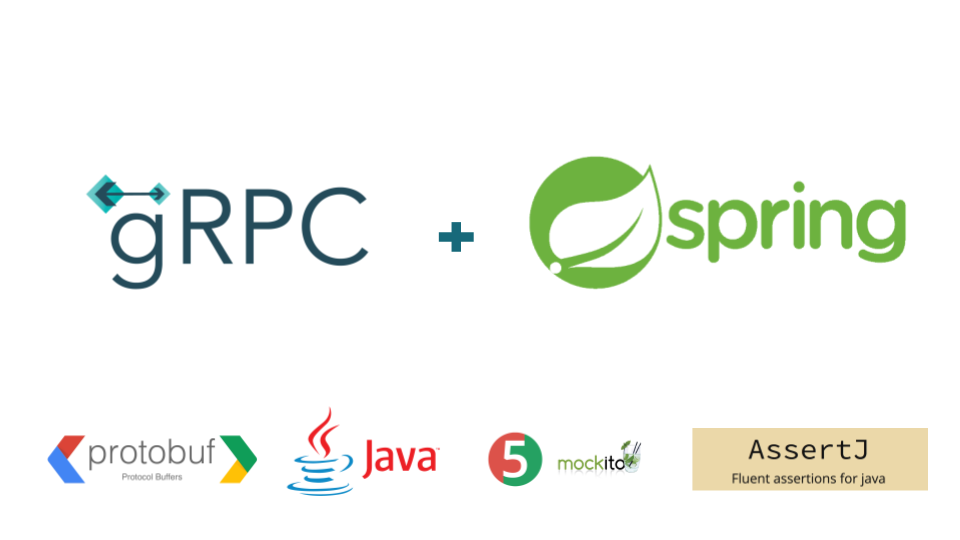
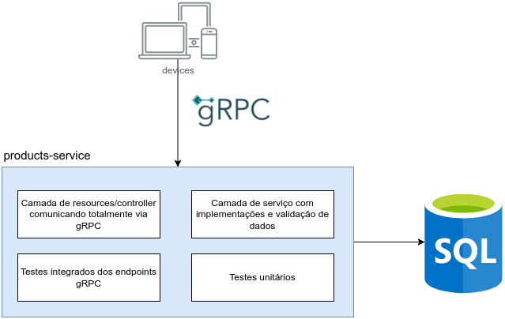

## Repositório do curso [Spring Boot e gRPC - Crie uma aplicação com gRPC e Java](https://www.udemy.com/course/spring-boot-e-grpc-crie-uma-aplicacao-com-grpc-e-java/?referralCode=D89F92BA0DE3FE9632F1)

Este repositório possui o código desenvolvido durante o curso [Spring Boot e gRPC - Crie uma aplicação com gRPC e Java](https://www.udemy.com/course/spring-boot-e-grpc-crie-uma-aplicacao-com-grpc-e-java/?referralCode=D89F92BA0DE3FE9632F1).

## Stack
- Spring Boot;
- [gRPC-Spring-Boot-Starter](https://yidongnan.github.io/grpc-spring-boot-starter/en/)
- Protocol Buffers;
- Java 11;
- AssertJ;
- Mockito.

## O que vamos aprender?
- O que é RPC;
- O que é gRPC;
- O que é Protocol Buffers e arquivos .proto;
- Pontos importantes sobre alteração de arquivos .proto e impactos nas comunicações;
- Implementar serviços gRPC para criar, buscar e deletar produtos;
- Testes integrados dos enpoints de serviços gRPC implementados;
- Testes unitários das camadas de regra de negócio e validações.

## Estrutura do projeto desenvolvido

